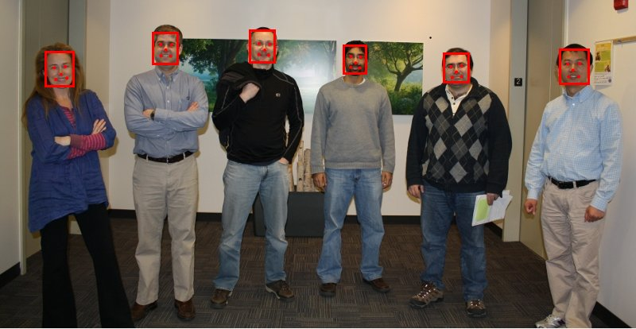
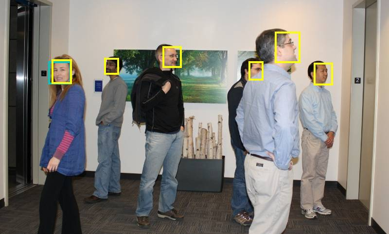

# Face Detection and Alignment MTCNN

[](https://circleci.com/gh/acampbel/mtcnn-face-detection) 
[](https://codecov.io/gh/matlab-deep-learning/mtcnn-face-detection)

## [__Download the toolbox here__](https://github.com/matlab-deep-learning/mtcnn-face-detection/releases/latest/download/MTCNN-Face-Detection.mltbx)

This repository implements a deep-learning based face detection and facial landmark localization model using [multi-task cascaded convolutional neural networks (MTCNNs)](https://kpzhang93.github.io/MTCNN_face_detection_alignment/). 

- [📦 Installation](#installation)
- [🏁 Getting Started](#getting-started)
- [🔎😄 Usage](#usage)
- [❓ About](#about)
- [💬 Contribute](#contribute)

_Note: This code supports inference using a pretrained model. Training from scratch is not supported. Weights are imported from the [original MTCNN model](https://kpzhang93.github.io/MTCNN_face_detection_alignment/) trained in Caffe._

## Installation

- Face Detection and Alignment MTCNN requires the following products:
  - MATLAB R2019a or later (_now works in R2019a and later!_)
  - Deep Learning Toolbox
  - Computer Vision Toolbox
  - Image Processing Toolbox
- Download the [latest release](https://github.com/matlab-deep-learning/mtcnn-face-detection/releases/) of the Face Detection and Aligment MTCNN. To install, open the .mltbx file in MATLAB.

## Getting Started

To get started using the pretrained face detector, import an image and use the `mtcnn.detectFaces` function:

```matlab
im = imread("visionteam.jpg");
[bboxes, scores, landmarks] = mtcnn.detectFaces(im);
```

This returns the bounding boxes, probabilities, and five-point facial landmarks for each face detected in the image.



## Usage

The `detectFaces` function supports various optional arguments. For more details, refer to the help documentation for this function by typing `help mtcnn.detectFaces` at the command window.

To get the best speed performance from the detector, first create a `mtcnn.Detector` object, then call its `detect` method on your image. Doing so ensures that the pretrained weights and options are loaded before calling detect:

```matlab
detector = mtcnn.Detector();
[bboxes, scores, landmarks] = detector.detect(im);
```

The detector object accepts the same optional arguments as the `mtcnn.detectFaces` function.

Refer to the MATLAB toolbox documentation or [click here](docs/getting_started.md) for a complete example.

## About

The MTCNN face detector is fast and accurate. Evaluation on the [WIDER face benchmark](http://mmlab.ie.cuhk.edu.hk/projects/WIDERFace/WiderFace_Results.html) shows significant performance gains over non-deep learning face detection methods. Prediction speed depends on the image, dimensions, pyramid scales, and hardware (i.e. CPU or GPU). On a typical CPU, for VGA resolution images, a frame rates ~10 fps should be achievable.

In comparisson to MATLAB's built in `vision.CascadeObjectDetector` the MTCNN detector is more robust to facial pose as demonstrated in the image below.



_Face detection from MTCNN in yellow, detections from the built in vision.CascadeObjectDetector in teal._


## Contribute

Please file any bug reports or feature requests as [GitHub issues](https://github.com/matlab-deep-learning/mtcnn-face-detection/issues). In particular if you'd be interested in training your own MTCNN network comment on the following issue: [Support training MTCNN](https://github.com/matlab-deep-learning/mtcnn-face-detection/issues/1)

_Copyright 2019 The MathWorks, Inc._
